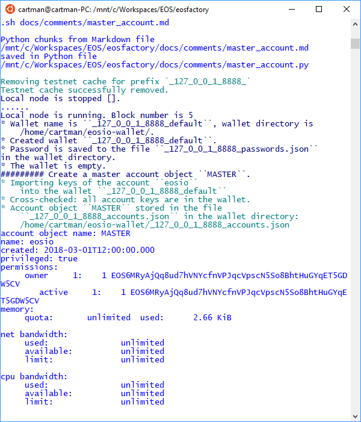
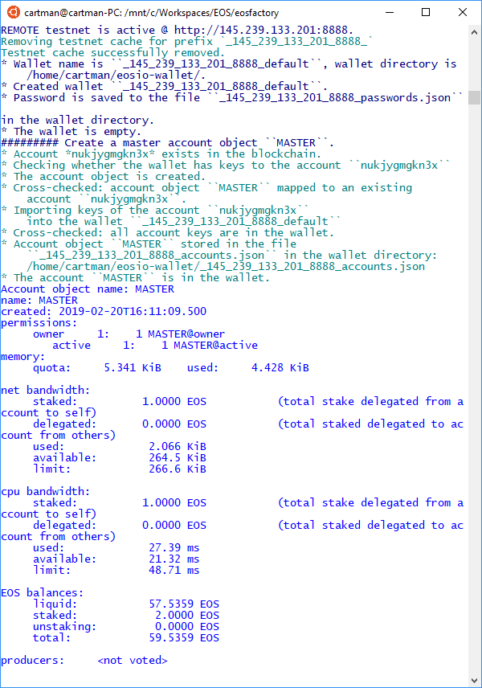
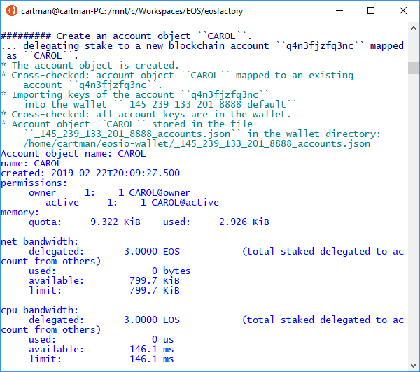

# MASTER Account Object

*EOSFactory* wraps *EOSIO* accounts using Python objects, i.e. instances of the `Account` class. A MASTER account is also an instance of the `Account` class, but it plays a special role in *EOSFactory*: it spawns other accounts into existence.

The implementation of a MASTER account is dependent on the context:

* On a local (private) testnet the MASTER account refers to the `eosio` privileged account. As such, it has limited capabilities, e.g. it cannot be associated with a smart-contract.
* On a remote (public) testnet the MASTER account refers to the initial account created by the user manually. On the creation, their private keys are placed in a wallet associated with the testnet. The account behaves like a normal account and can be used to sponsor the creation of other accounts.

Let's consider two scenarios: first a local (private) testnet, and then a more complex situation of a remote (public) testnet.

## Local testnet

Create a new Python session and import *EOSFactory* API:

```bash
python3
```

```python
from eosfactory.eosf import *
```

First, let's start a local testnet:

```python
reset()
```

Next, we create a wallet and then we use the `create_master_account` command to create a global variable named `MASTER` referencing the `eosio` account.

```python
create_master_account("MASTER")
MASTER.info()
```
Here is the expected outcome:



And finally, we show how the `MASTER` variable can be used to create other accounts:

```python
create_account("ALICE", MASTER)
ALICE.info()
```

## Remote testnet

Create a new Python session and import *EOSFactory* API:

```bash
python3
```

Alternatively, reboot the current session:
```python
reboot()
```
The command `reboot()` stops the local testnet and resets all the run-time settings of EOSFactory.

First, we need to define a remote testnet and pass to *EOSFactory* the data of the account we control there. EOSFactory uses objects of the class `Testnet` and maintain a list of them that can be displayed with the command `python3 -m eosfactory.testnets`. The entries of the lis can be produced with the command `python3 -m eosfactory.register_testnet <node url> <testnet pseudo>` (for example: `python3 -m eosfactory.register_testnet http://145.239.133.201:8888 JUNGLE3 zero`).

Here, we use hard-codded parameters of an account on a remote testnet. This setting may fail to work for you but you can find another one, as it is described in a [tutorial](../tutorials/05.InteractingWithPublicTestnet.md).

```python
testnet = Testnet(
    "5jejduh2w2cb",
    "5KGVA3efMr4rZEWUxWQzD4k11sApFrjYwVYfsVqvBYge1AppHdh",
    "5KAkkZLZVQbhJL6JnxodcBScgLi1LNv8yEX5LRXaWvXyoH87DK8",
    "http://145.239.133.201:8888")

reset(testnet)
# resume(testnet)
```

We supply four parameters:

- an URL of a public node offering access to the testnet, e.g. `http://145.239.133.201:8888` that is *Jungle Testnet*,
- the name of an existing account on this testnet, here `5jejduh2w2cb`,
- the account's owner & active private keys.

Note that here we expose private keys while they should be kept in wallets. We do this in order to allow for modification of these parameters. In fact, on testnet registration the keys go to a wallet named after the url of the testnet node. EOSFactory knows the name of the proper wallet from the `testnet` argument in the functions `reset(testnet)` and `resume(testnet)`.

The command `reset(testnet)` starts a new wallet, named according to the testnet, and populates it with the private keys of the account. Note that the creation of the account could be made secretly, on side. Then, the account can be restored to the current session with the command `resume(testnet.url)` without revealing the secret keys.

EOSFactory features persistence: if outlives account objects used in the previous session. The command `reset` destroys the memory, it deletes the wallet associated with the testnet and mapping between account objects and physical accounts. Therefore, the command has to be used with care. Here, we have it here to be able to change the testnet settings.

On the other hand, the command `resume` resumes the previous session.

We proceed to create a global variable named `MASTER` referencing the remote testnet account:

```python
create_master_account("MASTER", testnet)
MASTER.info()
```

**NOTE:** In this case the `create_master_account` command takes an extra parameter, i.e. the reference to the remote testnet.

And finally, we show how the `MASTER` variable can be used to create other accounts:

```python
create_account("CAROL", MASTER, buy_ram_kbytes=8, stake_net=3, stake_cpu=3)
CAROL.info()
```

**NOTE:** You might want to tweak with the extra parameters, i.e. `buy_ram_kbytes`, `stake_net` and `stake_cpu`.

Here is the expected outcome:




